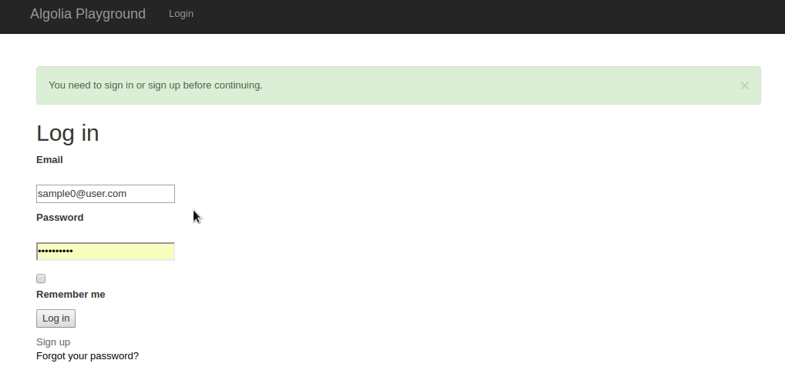

[](https://houndci.com)

# README

This sample application is for using the `algolia-rails` gem - It points to a multi-tennanted fork of the gem that I have written.



## Local rails

To get started clone this repo:

Duplicate `.env.example` to `.env` and add your algolia credentials.

You just need to migrate the database and run the server

```bash
rails db:migrate && rails s
```

## Setting Up Tenants

Use devise to sign in at localhost:3000 - fill in the `subdomain field` Now - note your subdomain.

You should migrate again because I am using sqlite3 and I get an error if I don't migrate because of connection pooling.

## Go to your Subdomain

Once you create your account go to

`<subdomain>.lvh.me:3000`

Start to create `Posts` - only the published ones will go to algolia.

## Algolia Dashboard

Expect to see an index `#{sub_domain}_Post_development`.

## Multi-Tennancy

A new index should be created for every model and every subdomain that includes the code:

```ruby
algoliasearch per_environment: true, if: :published?, per_tenant: Proc.new { Apartment::Tenant.current } do
end
```


